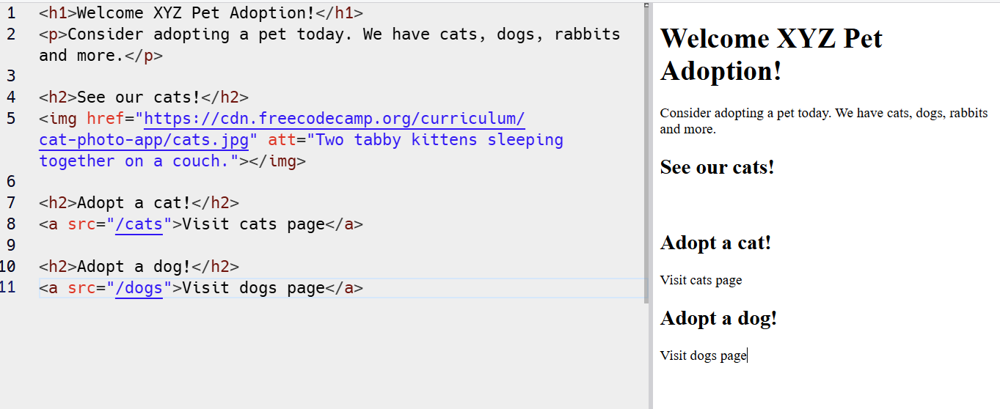
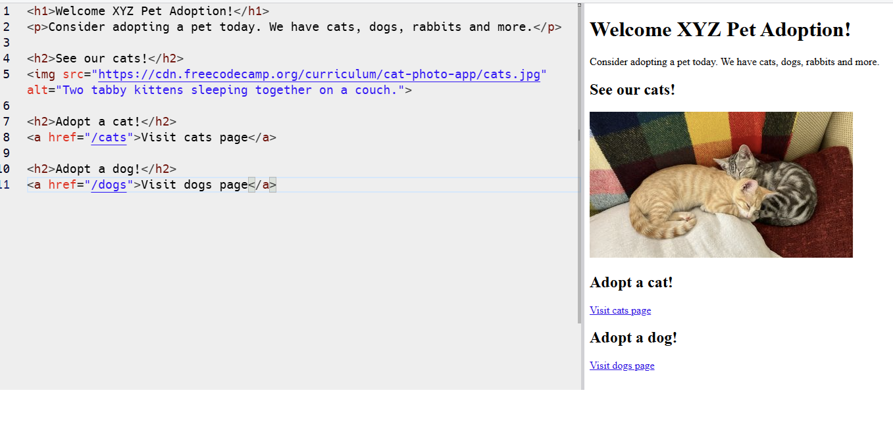

# Debug Pet Adoption Page

This is a solution for the freeCodeCamp's "Debug a Pet Adoption Page" challenge.

##  Scenario
Sally, a pet adoption store owner, has built her first web page, but it has syntax errors. Images are not loading, and links are broken. My job is to debug the existing code so she can continue building her page.

## Known Issues (The Errors)
Upon analysing the original code, the following bugs were found:
1. **Broken Images:** The `` tag is using an `href` attribute (which is for links) instead of a source attribute.
2. **Accessibility Error:** The image has a made-up `att` attribute instead of the standard `alt` attribute.
3. **Invalid HTML:** The `` element has a closing tag (`</img>`), but image tags are "void" elements and should not close.
4. **Broken Links:** The anchor `<a>` tags for the Cat and Dog pages are using `src` attributes instead of `href`.

## Solution Checklist (The Fixes)
To resolve these issues and pass the User Stories, I completed the following tasks:

- [x] **Fix Image Source:** Replaced `href` with `src` in the `img` element.
- [x] **Fix Alt Text:** Replaced `att` with `alt` to provide descriptive text.
- [x] **Fix Syntax:** Removed the `</img>` closing tag.
- [x] **Fix Cat Link:** Changed `src` to `href` in the "Visit cats page" link.
- [x] **Fix Dog Link:** Changed `src` to `href` in the "Visit dogs page" link.

### Visual Results

### Before Debugging

### After Debugging

####  Technologies
- **HTML5 Debugging**
